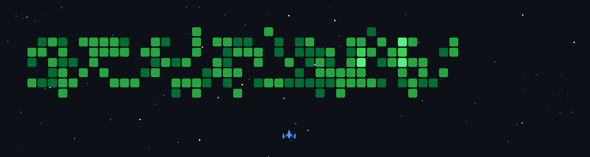

# Neetesh Jatav | ML Researcher & Freelancer

## 👨‍💻 About Me

Hello! I'm **Neetesh Jatav**, a passionate **Machine Learning Researcher** and **Freelance Web/AI Engineer** based in **Shivpuri, Madhya Pradesh, India**. I specialize in building robust predictive models, optimizing ML pipelines, and deploying AI solutions for real-world problems in Healthcare, Finance (AML), and Computer Vision.

- 🎓 **B.Tech in Artificial Intelligence & Machine Learning** (MITS, Gwalior)
- 💼 **Machine Learning Intern** at Cognifyz Technologies
- 🔬 **Published Researcher** (Springer Nature, Scopus Indexed)
- 🏆 **Kaggle Contributor** (Top performances in medical datasets)

---

## 🚀 Technical Skills

| Domain | Technologies & Tools |
| :--- | :--- |
| **Languages** | Python (Expert), C/C++, Java, SQL, Bash |
| **ML/DL Frameworks** | TensorFlow, PyTorch, Scikit-learn, XGBoost, LightGBM, CatBoost |
| **Data Processing** | Pandas, NumPy, cuDF (GPU Acceleration) |
| **Optimization** | Optuna, Particle Swarm Optimization (PSO), Grey Wolf Optimization (GWO) |
| **Deployment & DevOps** | Docker, REST APIs (Flask/FastAPI), Git, Linux |
| **Computer Vision** | OpenCV, DeepLabV3, Image Processing |

---

## 🛠 Selected Projects

### 🏥 [ICU Risk Stratification Model](https://github.com/1901neetesh)
*Dual-Stage Predictive Modeling for Intensive Care Units*
- **Objective:** Predict patient mortality risk using clinical data.
- **Tech Stack:** XGBoost, cuDF, Survival Analysis.
- **Impact:** Achieved **0.9755 AUC** on 70k+ test cases (MIMIC-IV dataset).
- **Publication:** Accepted at **ICSISCET 2025**.

### 💸 [Money Laundering Detection System](https://github.com/1901neetesh)
*Advanced Fraud Detection using Metaheuristics*
- **Objective:** Identify illicit transactions in large-scale banking data.
- **Methodology:** Combined **XGBoost** with **PSO & GWO** for hyperparameter tuning.
- **Key Features:** Handled 32M+ transactions, addressed class imbalance with SMOTE, deployed via Containerized API.

### 🍽 [Restaurant Rating Predictor](https://github.com/1901neetesh)
- **Objective:** Predict restaurant ratings based on user reviews and metadata.
- **Outcome:** **~91% Accuracy** using ensemble methods (LightGBM + CatBoost).

---

## 📫 Get in Touch

I am open to **freelance opportunities, research collaborations, and full-time roles**.

- **Email:**
    - [neeteshjatav11@gmail.com](mailto:neeteshjatav11@gmail.com)
    - [neeteshjatav19@gmail.com](mailto:neeteshjatav19@gmail.com)
- **Phone:** +91 81030 54195
- **Location:** Shivpuri, Madhya Pradesh, India
- **Kaggle:** [kaggle.com/neetesh1901](https://kaggle.com/neetesh1901)
 - **Portfolio:** [1901neetesh.github.io/1901neetesh](https://1901neetesh.github.io/1901neetesh)

---

*© 2026 Neetesh Jatav*
